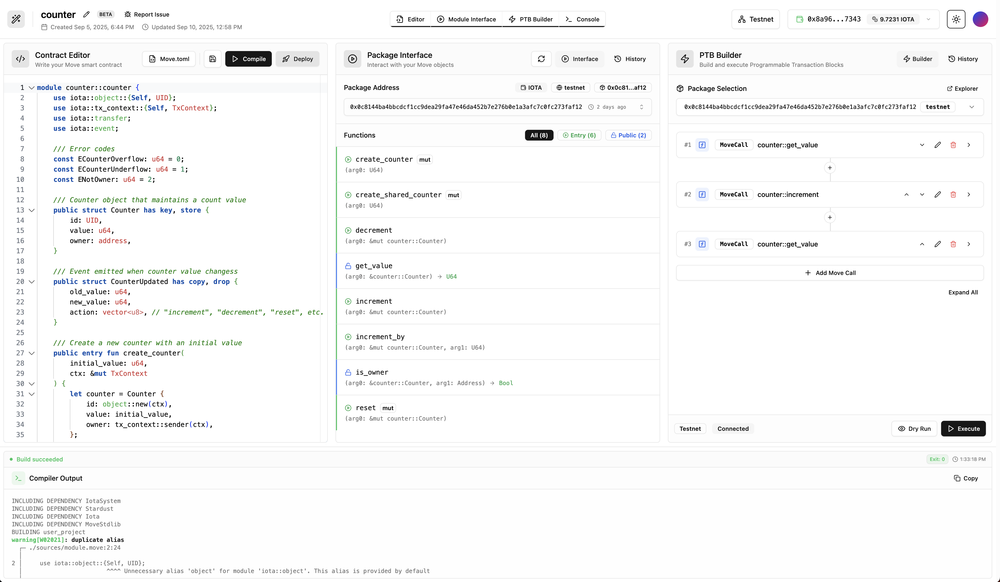

  <h1>
    IOTA Playground
  </h1>

  

    Write, compile, and deploy IOTA Move smart contracts directly in your browser.
  

  

    <a href="https://playground.iota.org">playground.iota.org</a>
    ·
    <a href="https://docs.iota.org">Documentation</a>
  

   
  
  

## ✨ Features

IOTA Playground is a browser-based development environment that makes IOTA Move development simple and accessible.

- **Zero Setup Required** - Start building Move smart contracts instantly
- **Professional Editor** - Full syntax highlighting with Move language support
- **Instant Compilation** - Compile Move to bytecode in seconds
- **Built-in Deployment** - Deploy to IOTA testnet with pre-funded wallet
- **Interactive Testing** - Test contracts through auto-generated interface
- **Code Sharing** - Share contracts via public links

## 💫 IOTA Playground vs Traditional Setup

| Feature | Traditional Setup | IOTA Playground |
|---------|-------------|---------|
| Initial Setup | 30+ minutes of installation & configuration | < 30 seconds - just open browser |
| Prerequisites | Move toolchain, CLI tools, VS Code | Modern web browser only |
| Development | Local machine setup with multiple tools | Fully browser-based IDE |
| Compilation | Local Move compiler configuration | Instant cloud compilation |
| Deployment | Manual wallet & network configuration | One-click deployment with pre-funded wallet |
| Testing | Local test environment setup | Instant ABI generation & testing interface |
| Updates | Manual toolchain updates | Always up-to-date platform |
| Collaboration | Complex environment sharing | Instant contract sharing |

## 🤝 Contributing

Contributions are welcome! Please read our [Contributing Guide](CONTRIBUTING.md) for details on our code of conduct and the process for submitting pull requests.